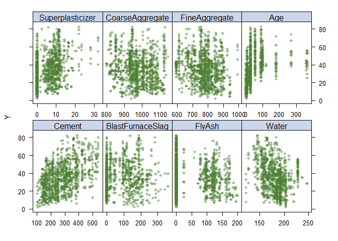
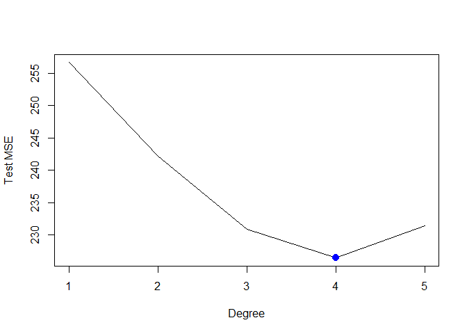
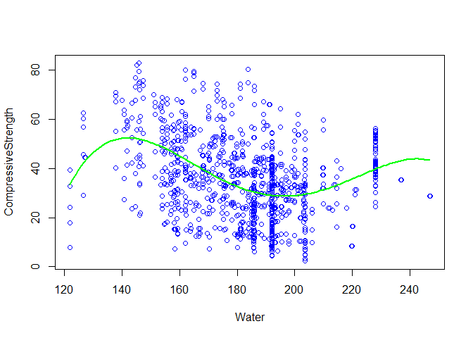
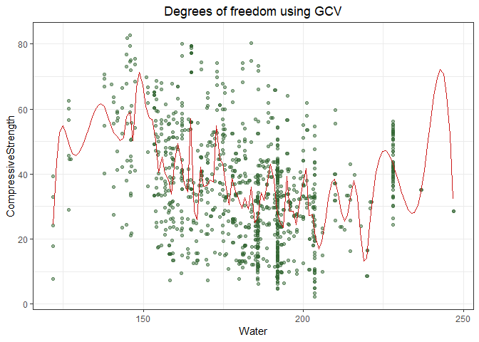
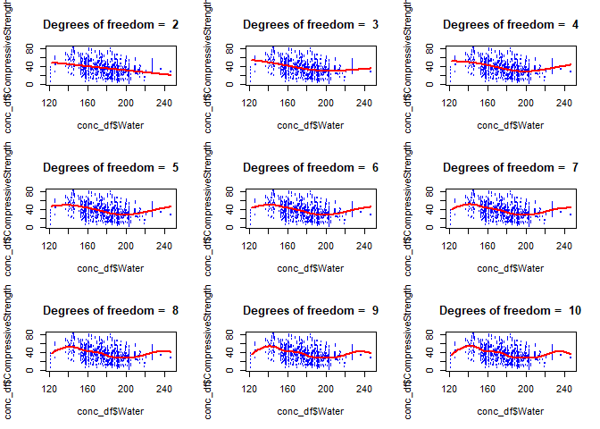
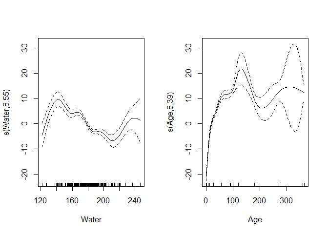

datascience\_hw2
================
Jyoti Ankam
March 16, 2019

``` r
library(tidyverse)
library(caret)
library(gam)
library(boot)
library(mgcv)
```

Reading/loading the datasets:

``` r
conc_df <- read.csv("C:/Users/Jyoti/Desktop/Data_Science/data/concrete.csv")
```

``` r
x = model.matrix(CompressiveStrength ~ ., conc_df)[,-1]
y = conc_df$CompressiveStrength
```

Scatter Plots for variables visualization - Qs. a)
--------------------------------------------------

``` r
theme1 <- trellis.par.get()
theme1$plot.symbol$col <- rgb(.3, .5, .2, .5)
theme1$plot.symbol$pch <- 18   
theme1$plot.line$col <- rgb(.8, .1, .1, 1)
theme1$plot.line$lwd <- 2
theme1$strip.background$col <- rgb(.0, .2, .6, .2)
trellis.par.set(theme1)
featurePlot(x, y, plot = "scatter", labels = c("","Y"),
            type = c("p"), layout = c(4, 2))
```



Using cross-validation to obtain the optimal degree for the polynomial - Qs. b)

``` r
set.seed(1)
deltas <- rep(NA, 5)
for (i in 1:5) {
    fit <- glm(CompressiveStrength ~ poly(Water, i), data = conc_df)
    deltas[i] <- cv.glm(conc_df, fit, K = 10)$delta[1]
}

plot(1:5, deltas, xlab = "Degree", ylab = "Test MSE", type = "l")
d.min <- which.min(deltas)
points(which.min(deltas), deltas[which.min(deltas)], col = "blue", cex = 2, pch = 20)
```



The chosen optimal d is 4

Now using ANOVA to test the subsets:

``` r
fit1 = lm(CompressiveStrength ~ Water, data = conc_df)
fit2 = lm(CompressiveStrength ~ poly(Water, 2), data = conc_df)
fit3 = lm(CompressiveStrength ~ poly(Water, 3), data = conc_df)
fit4 = lm(CompressiveStrength ~ poly(Water, 4), data = conc_df)
fit5 = lm(CompressiveStrength ~ poly(Water, 5), data = conc_df)
```

``` r
anova(fit1, fit2, fit3, fit4, fit5)
```

    ## Analysis of Variance Table
    ## 
    ## Model 1: CompressiveStrength ~ Water
    ## Model 2: CompressiveStrength ~ poly(Water, 2)
    ## Model 3: CompressiveStrength ~ poly(Water, 3)
    ## Model 4: CompressiveStrength ~ poly(Water, 4)
    ## Model 5: CompressiveStrength ~ poly(Water, 5)
    ##   Res.Df    RSS Df Sum of Sq      F    Pr(>F)    
    ## 1   1028 263085                                  
    ## 2   1027 247712  1   15372.8 68.122 4.696e-16 ***
    ## 3   1026 235538  1   12174.0 53.947 4.197e-13 ***
    ## 4   1025 231246  1    4291.5 19.017 1.426e-05 ***
    ## 5   1024 231081  1     165.9  0.735    0.3915    
    ## ---
    ## Signif. codes:  0 '***' 0.001 '**' 0.01 '*' 0.05 '.' 0.1 ' ' 1

By looking at the p-values and results from ANOVA, we can see that degree 4 or 5 polynomial provide a reasonable fit to the data. Here, let's choose 4 polynomial to make it a parsimonious model.

``` r
plot(CompressiveStrength ~ Water, data = conc_df, col = "blue")
limswater <- range(conc_df$Water)
water.grid <- seq(from = limswater[1], to = limswater[2], by = 1)
fit <- lm(CompressiveStrength ~ poly(Water, 4), data = conc_df)
preds <- predict(fit, newdata = data.frame(Water = water.grid))
lines(water.grid, preds, col = "green", lwd = 2)
```



Using generalized cross validation for choosing the degrees of freedom - Question c)

``` r
fit.ss <- smooth.spline(conc_df$Water, conc_df$CompressiveStrength)
fit.ss$df
```

    ## [1] 68.88205

``` r
pred.ss <- predict(fit.ss, x = water.grid)

pred.ss.df <- data.frame(pred = pred.ss$y,
                         water = water.grid)

p <- ggplot(data = conc_df, aes(x = Water, y = CompressiveStrength)) +
  geom_point(color = rgb(.2, .4, .2, .5))

p + geom_line(aes(x = water, y = pred), data = pred.ss.df, 
              color = rgb(.8, .1, .1, 1)) + theme_bw() + 
  labs(title = 'Degrees of freedom using GCV') + 
  theme(plot.title = element_text(hjust = 0.5))
```



Fitting for different degrees of freedom for 2 to 10

``` r
par(mfrow = c(3,3)) # 3 x 3 grid
all.dfs = rep(NA, 9)
for (i in 2:10) {
  fit.ss = smooth.spline(conc_df$Water, conc_df$CompressiveStrength, df = i)
  
  pred.ss <- predict(fit.ss, x = water.grid)
  
  plot(conc_df$Water, conc_df$CompressiveStrength, cex = .5, col = "blue")
  title(paste("Degrees of freedom = ", round(fit.ss$df)),  outer = F)
  lines(water.grid, pred.ss$y, lwd = 2, col = "red")
}
```

 From the plots above, we can see that it is most linear at df = 2.

Now, fitting a GAM using all the predictors - question d):

``` r
gam.m1 <- mgcv::gam(CompressiveStrength ~ Cement + BlastFurnaceSlag + FlyAsh + s(Water) + Superplasticizer + CoarseAggregate + FineAggregate + s(Age), data = conc_df)

par(mfrow = c(1,2))
plot(gam.m1)
```



Re-specifying model after removing the s() from the apparently linear variables, and assessing the results again

``` r
gam.m2 <- mgcv::gam(CompressiveStrength ~ Cement + BlastFurnaceSlag + FlyAsh + Water + Superplasticizer + CoarseAggregate + FineAggregate + Age, data = conc_df)

anova(gam.m1, gam.m2, test = 'F')
```

    ## Analysis of Deviance Table
    ## 
    ## Model 1: CompressiveStrength ~ Cement + BlastFurnaceSlag + FlyAsh + s(Water) + 
    ##     Superplasticizer + CoarseAggregate + FineAggregate + s(Age)
    ## Model 2: CompressiveStrength ~ Cement + BlastFurnaceSlag + FlyAsh + Water + 
    ##     Superplasticizer + CoarseAggregate + FineAggregate + Age
    ##   Resid. Df Resid. Dev      Df Deviance      F    Pr(>F)    
    ## 1    1005.2      43122                                      
    ## 2    1021.0     110413 -15.757   -67291 99.632 < 2.2e-16 ***
    ## ---
    ## Signif. codes:  0 '***' 0.001 '**' 0.01 '*' 0.05 '.' 0.1 ' ' 1

The purpose of generalized additive models is to maximize the quality of prediction of the dependent variable CompressiveStrength from various distributions, by estimating unspecific (non-parametric) functions of the predictor variables (above) which are "connected" to the dependent variable via a link function. We can see from the scatterplots produced, the smoothed predictor variable values plotted against the partial residuals, i.e., the residuals after removing the effect of all other predictor variables. GAMs as non-parametric curve fitters attempt to achieve an optimal compromise between goodness-of-fit and parsimony of the final curve. The solid line is the predicted value of the dependent variable CompressiveStrength as a function of the x axis.The dotted lines are plus-or-minus two standard errors, and the small lines along the x axis are the "rug", showing the location of the sample plots. From the plot, we can say that the model with the reduction in deviance is a parsimonius model.
